# Biosignal Platform — 병원용 웨어러블 생체신호 모니터링

입원 환자가 붙인 웨어러블 패치의 심전도·호흡·산소포화도·체온·움직임을 병원 전체에서 실시간으로 모으고, 알람·위치·기록·EMR 연동까지 웹 화면 하나에서 다룹니다. 환자 2,100명을 라즈베리파이 5 한 대로 처리하는 환경에서 검증했습니다.

- 병원 계정(의사·간호사·스태프·IT 매니저)에는 **Patient Monitor**, 운영 계정(수퍼 어드민·시스템 관리자·리셀러·영업)에는 **Biomonitor Router** 이름으로 보입니다.
- 화면의 환자·병원 데이터는 모두 시뮬레이터가 만든 가상 데이터입니다.

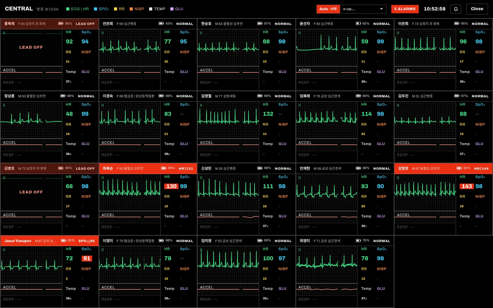

---

## 1. 실시간 모니터링

### 중앙 모니터
병동·병실·게이트웨이·담당의 단위로 환자를 한 화면에 모아 ECG 파형과 심박수·SpO₂·호흡수·체온을 실시간으로 보여 줍니다. 알람이 난 환자는 카드 전체가 알람색으로 바뀌고, 인원에 맞춰 칸 수가 자동으로 조절됩니다. 벽걸이 모니터용 전체 화면 탭으로 엽니다(맨 위 이미지).

### 환자 실시간 창
환자 아이콘이나 이름을 누르면 ECG(250 Hz) 스윕 파형, 3축 가속도, 바이탈 타일, 패치 상태(배터리 남은 일수·착용 일수·교체 예정)가 열립니다. 오른쪽에는 입원 기록·임상 정보·연동 EMR·검사 일정이 이어집니다. 보는 사람의 역할에 따라 항목 순서가 달라집니다(의료진은 입원 기록 먼저, 운영자는 패치·센서 먼저).

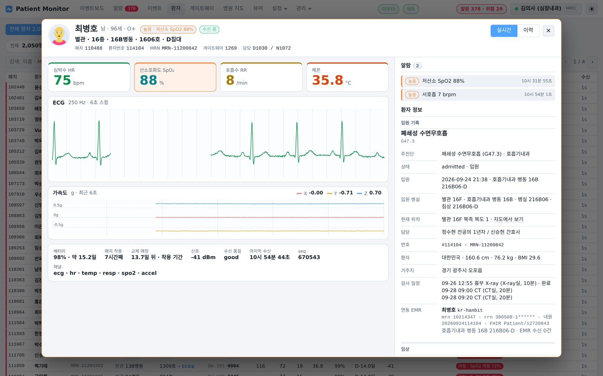
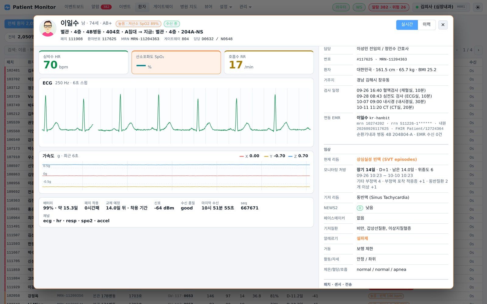

### 파형 기록(히스토리)
환자별 과거 파형을 10·30·60·120초 구간으로 거슬러 봅니다. 로컬에서 지운 과거 구간(☁)은 백업 서버에서 자동으로 받아 SHA-256으로 검증한 뒤 보여 줍니다.

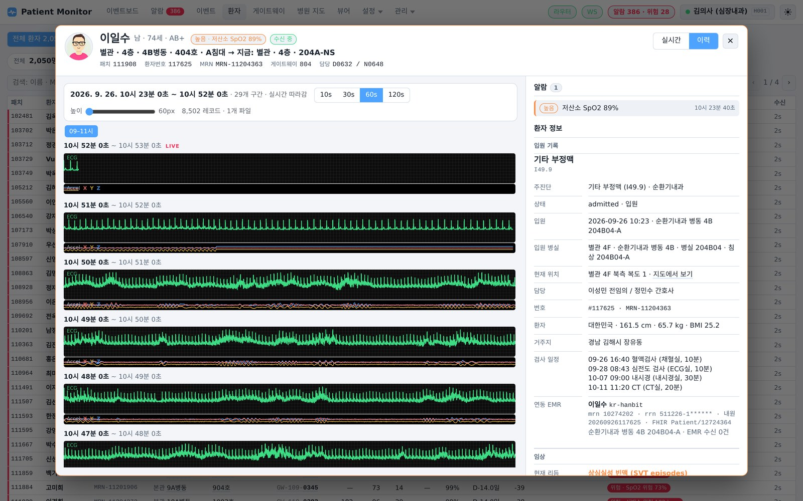

---

## 2. 알람과 이벤트

심박·SpO₂·호흡·체온 임계, 전극 탈락, SpO₂ 센서 이탈, 배터리 부족, 패치 무응답, 패치 교체 예정·필요, 게이트웨이 끊김·저하를 4단계 심각도로 알립니다.

- **알람 목록:** 심각도·미확인 칩으로 거르고, 병동·종류로 좁힙니다. 행을 누르면 오른쪽에 환자의 현재 바이탈과 확인·실시간 파형·지도 버튼이 나옵니다.
- **이벤트보드:** 지금 울리는 알람과 최근 이벤트를 한눈에 봅니다.
- **이벤트:** 알람·게이트웨이·저장·설정 이벤트를 시간순으로 기록합니다.

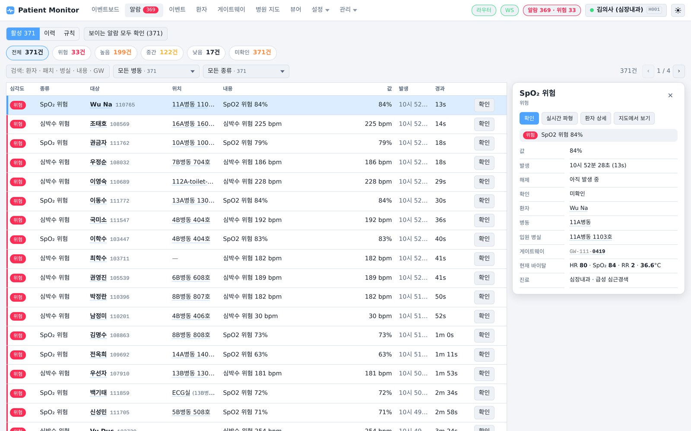
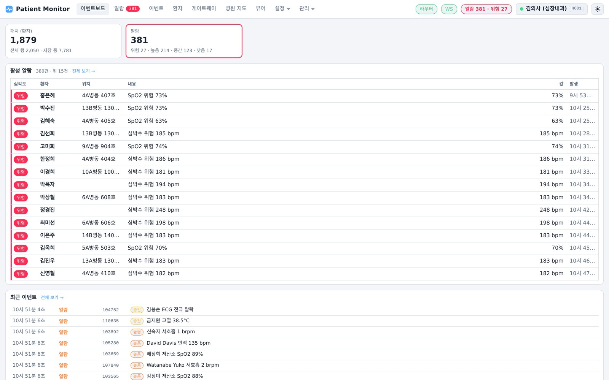
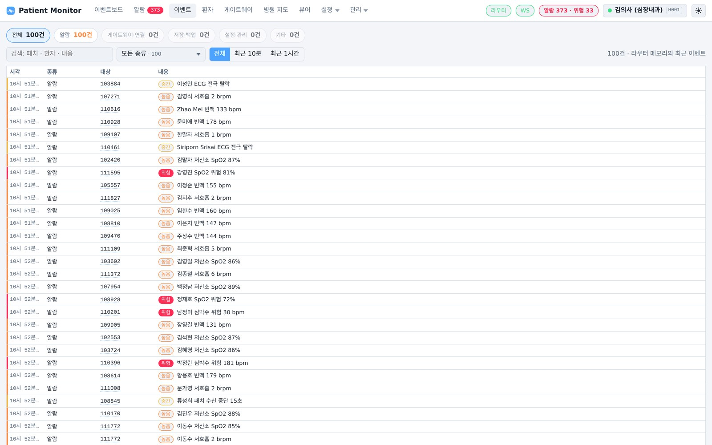

---

## 3. 병원 지도

건물·층별 도면 위에 환자·게이트웨이·알람을 겹쳐 보여 줍니다.

- 위험·높음 알람 환자는 알람색 원으로 멀리서도 눈에 띕니다.
- 아이콘에 마우스를 올리면 환자·게이트웨이 기본 정보 팁이 뜨고, 누르면 실시간 창이 열립니다.
- 병실을 누르면 그 병실 환자 목록과 병실 중앙 모니터 버튼이 나옵니다.
- 다른 화면의 **지도에서 보기**를 누르면 해당 층으로 이동해 5초 동안 강조합니다.
- 다크 테마, 게이트웨이 커버리지·음영지역 보기를 지원합니다.

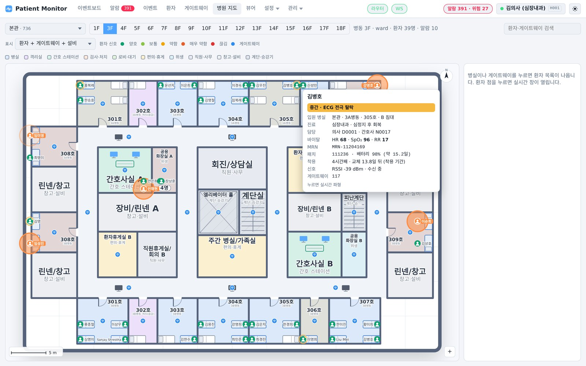
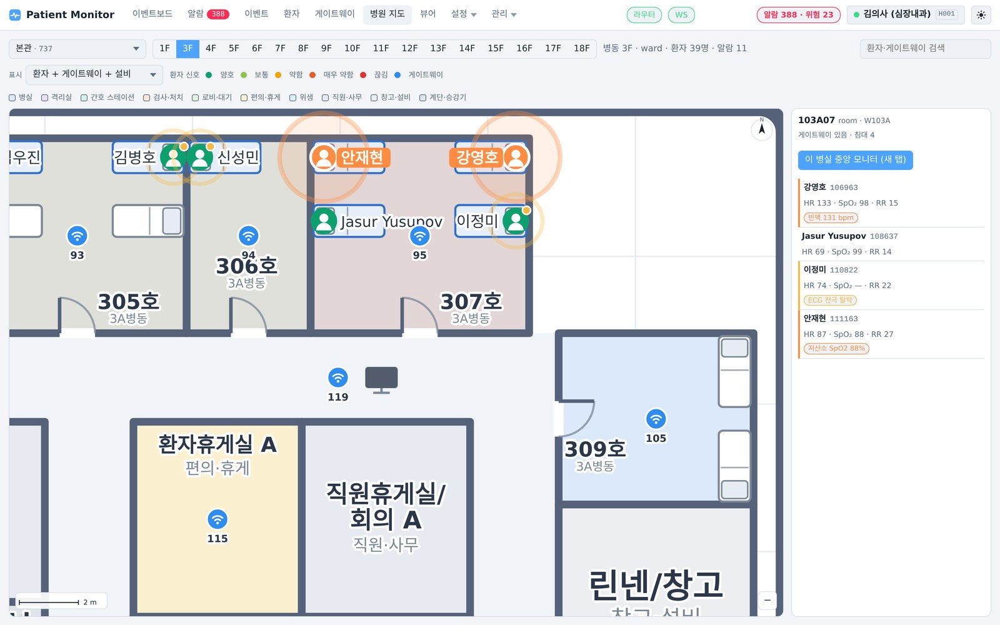
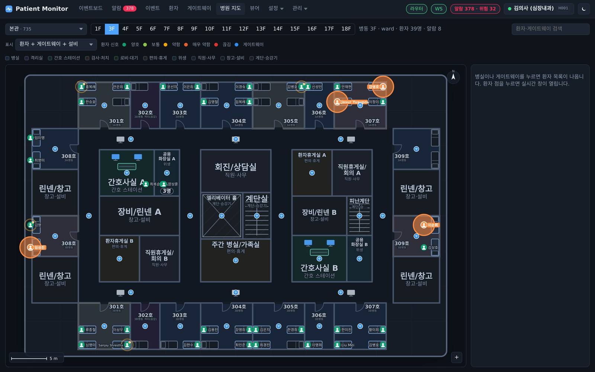
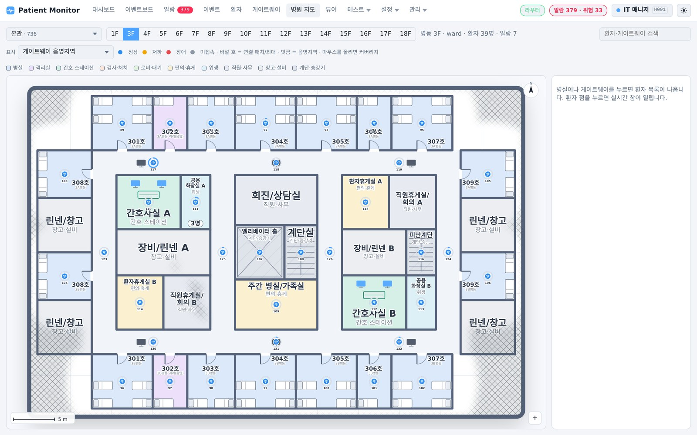

---

## 4. 환자와 이동 추적

- **환자 목록:** 알람·전극 탈락·수신 없음·배터리 부족·패치 교체 1일 이내·병실 밖 같은 조치 필요 조건을 칩으로 거릅니다. 병동·병실·게이트웨이는 서로 링크로 이어집니다.
- **이동 중 환자 타임테이블:** 검사·재활·투석·화장실 등으로 병실을 떠난 환자의 현재 단계, 진행률, 단계별 일정(현재 → 예정), 다음 예정 검사, 검사실별 사용 현황을 보여 줍니다.
- **패치 수명:** 착용 최대 14일, 배터리 약 15.5일 기준으로 교체 예정 시각을 계산해 알립니다.

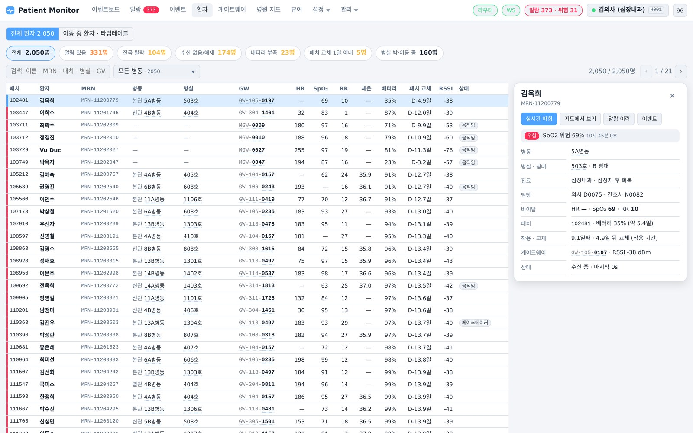
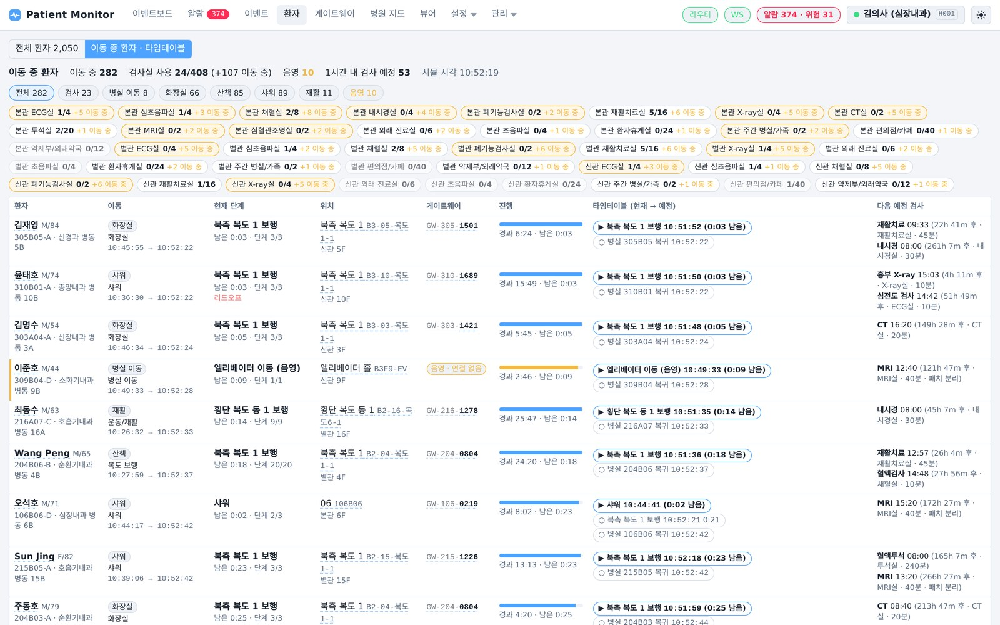

---

## 5. 운영과 인프라

- **대시보드:** CPU·메모리·저장소·수신량·유실·재시작을 1시간부터 1년 단위까지 봅니다(1분 단위 기록, 14일 보관 후 시간 단위).
- **게이트웨이:** 상태(정상·저하·끊김)별 칩, 건물·층·유형 필터, 게이트웨이별 부하·재전송·CRC 통계와 연결된 환자.

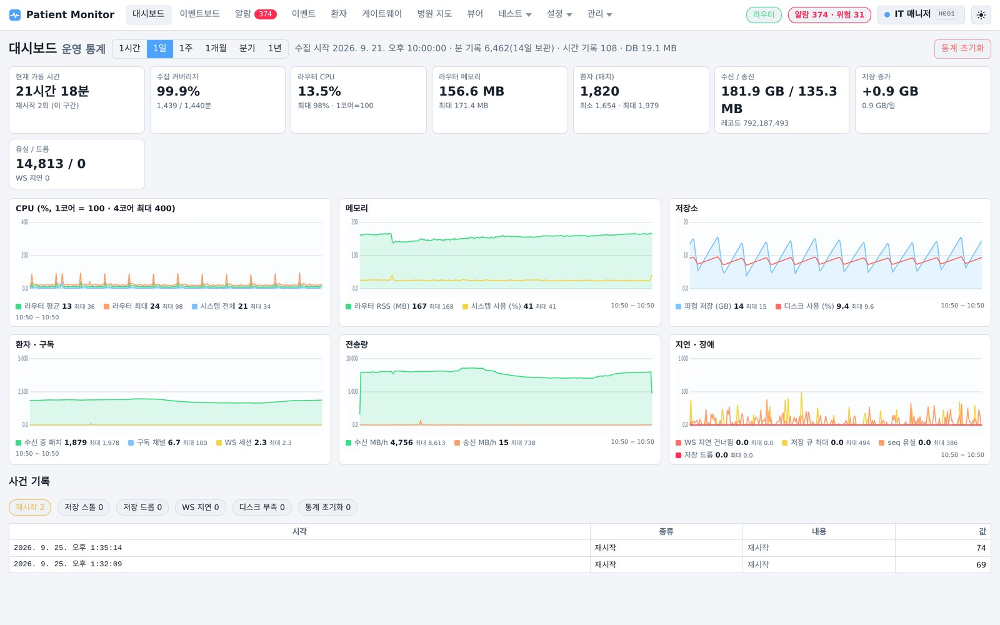
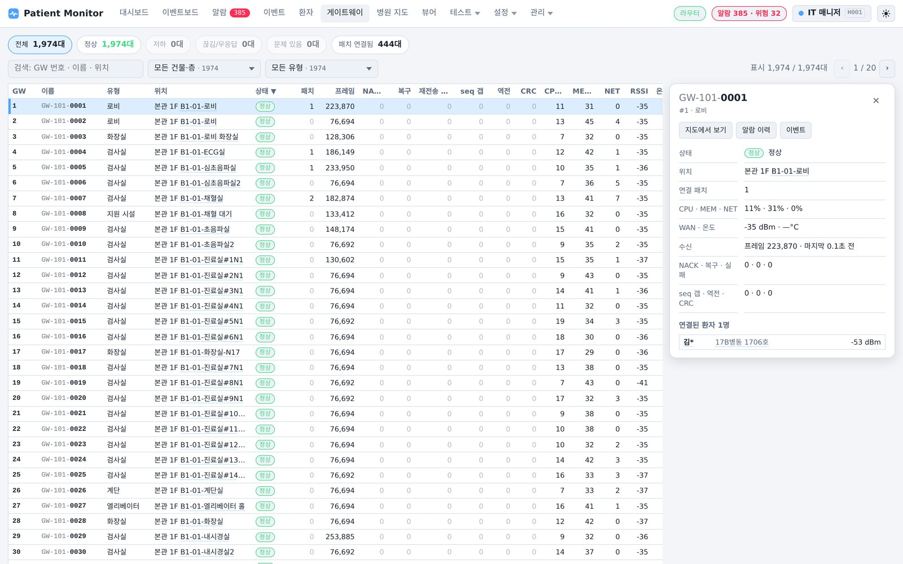

---

## 6. 생체 데이터 저장·백업

- 파형은 환자(패치)별로 2시간 단위 파일에 저장합니다(1~24시간 선택).
- 파일이 닫히면 모든 기록의 CRC를 검사하고 파일 전체의 CRC-32·SHA-256을 봉인 파일에 남깁니다.
- 봉인된 파일만 NAS·SMB·FTP·FTPS·SFTP로 백업하고, 원격에서 다시 읽어 SHA-256을 대조합니다.
- 저장소별 백업 목록, 백업 중단, 전체 삭제(권한 필요)를 제공합니다.

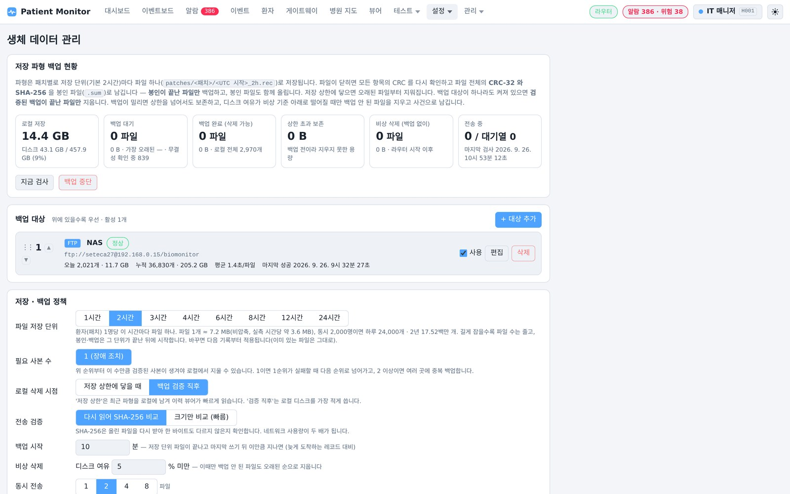
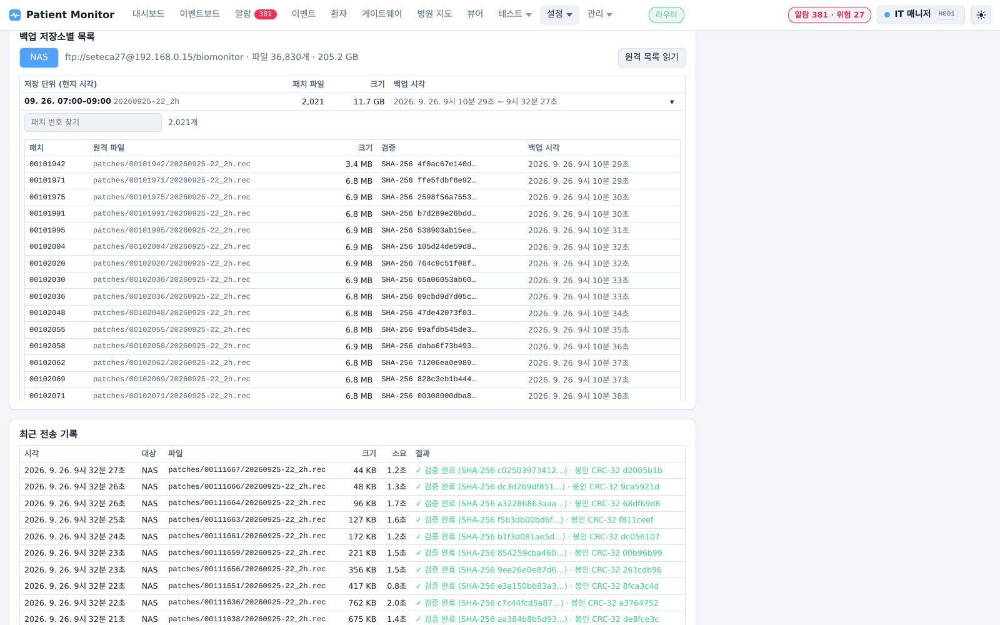

---

## 7. EMR 연동

FHIR R4·STU3(Epic·Oracle Health·KR Core 등), HL7 v2(MLLP), 국내 EMR JSON·EUC-KR XML·CDA R2, athenahealth REST를 지원합니다. 재원 명단과 입퇴원을 실시간으로 받아 환자를 맞추고, 바이탈을 각 EMR 형식으로 기록합니다. 국내·해외 20개 모의 병원 사이트로 검증했습니다.

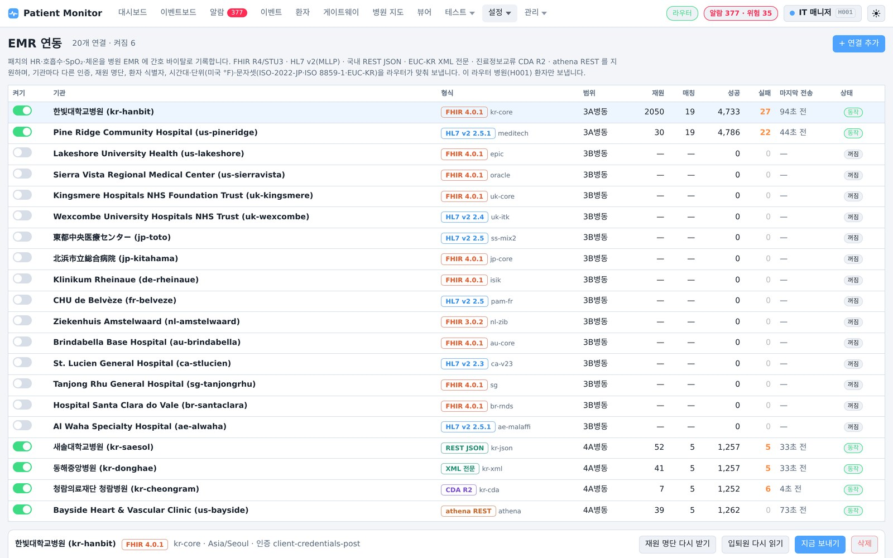

---

## 8. 계정·권한·보안

- 역할 8종: 수퍼 어드민 · 시스템 관리자 · 리셀러 · CRM 영업(플랫폼), 병원 IT 매니저 · 의사 · 간호사 · 스태프(병원).
- 메뉴 → 화면 안 기능 → 데이터 구조의 권한 표를 없음/보기/편집으로 설정합니다. 자기보다 아래 역할만 고칠 수 있습니다.
- 권한이 없으면 서버가 개인정보를 가리고 생체신호를 빼고 보냅니다.
- 병원(테넌트)별로 데이터가 분리되고, 로그인·권한 변경·삭제 같은 중요 동작은 감사 기록에 남습니다.

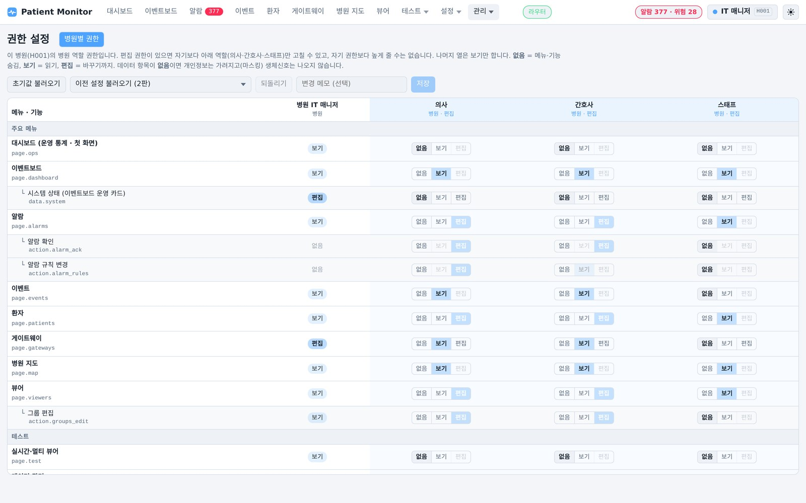

---

## 주요 사양

| 항목 | 사양 |
| --- | --- |
| 측정 채널 | ECG 250 Hz, 3축 가속도 50 Hz, PPG 100 Hz, 호흡 파형 25 Hz, 심박수·호흡수·SpO₂·체온·혈당 1초 1회, 페이스메이커 스파이크 |
| 검증 규모 | 환자 2,100명 · 게이트웨이 약 2,000대 · 초당 기록 약 11,000개 |
| 서버 부하 | 라즈베리파이 5(4코어, 4 GB) 기준 코어 1개의 약 12.5%, 메모리 약 150~176 MB |
| 전송 | 게이트웨이당 TCP 1개, 200 ms 프레임, CRC-32, 빠진 프레임 재전송 요청 |
| 저장 | 환자 1명 시간당 약 3.6 MB(비압축), gzip 시 약 57% |
| 무결성 | 기록별 CRC-32, 파일별 CRC-32·SHA-256 봉인, 백업·복원 SHA-256 검증 |
| 백업 | NAS · SMB · FTP · FTPS · SFTP, 사본 1~8개 |
| EMR | FHIR R4/STU3, HL7 v2 MLLP, 국내 JSON·XML·CDA, athenahealth |
| 화면 | 웹 브라우저(라이트·다크 테마), 전체 화면 중앙 모니터·침상 뷰어 |

> 모든 수치는 2026년 9월 에뮬레이터 부하 시험 값입니다(실제 병원 환경 검증 전).

---

## 이미지 파일

| 폴더 | 내용 |
| --- | --- |
| `web/*.jpg`, `web/*.webp` | 웹 게시용 1600 × 1000 (JPG 품질 88, WebP 85) |
| `screens/*.png` | 원본 3200 × 2000 (레티나·인쇄용) |

| 파일 | 화면 |
| --- | --- |
| 01-central-monitor | 중앙 모니터(다크, 병동 19명) |
| 02-eventboard | 이벤트보드 |
| 03-patient-live | 환자 실시간 창(파형·바이탈·패치) |
| 04-patient-info | 환자 정보(임상·검사 일정·연동 EMR) |
| 05-waveform-history | 파형 기록(백업 구간 포함) |
| 06-hospital-map | 병원 지도 + 환자 호버 팁 |
| 06b-hospital-map-dark | 병원 지도(다크) |
| 07-hospital-map-zoom | 병실 확대 + 병실 환자 목록 |
| 08-patients | 환자 목록 + 상세 패널 |
| 09-moving-patients | 이동 중 환자 타임테이블 |
| 10-alarms | 알람 목록 + 상세 패널 |
| 11-events | 이벤트 |
| 12-dashboard | 운영 대시보드 |
| 13-gateways | 게이트웨이 목록 + 상세 |
| 14-gateway-coverage | 게이트웨이 음영지역 |
| 15-data-backup | 생체 데이터 관리(저장·백업 정책) |
| 15b-backup-catalog | 백업 저장소별 목록·전송 기록 |
| 16-emr-integration | EMR 연동 20개 사이트 |
| 17-permissions | 권한 설정(역할별 권한 표) |

캡처: 2026-09-26, Chromium 1600 × 1000 @2x, 라이트 테마(중앙 모니터·다크 지도 제외).
